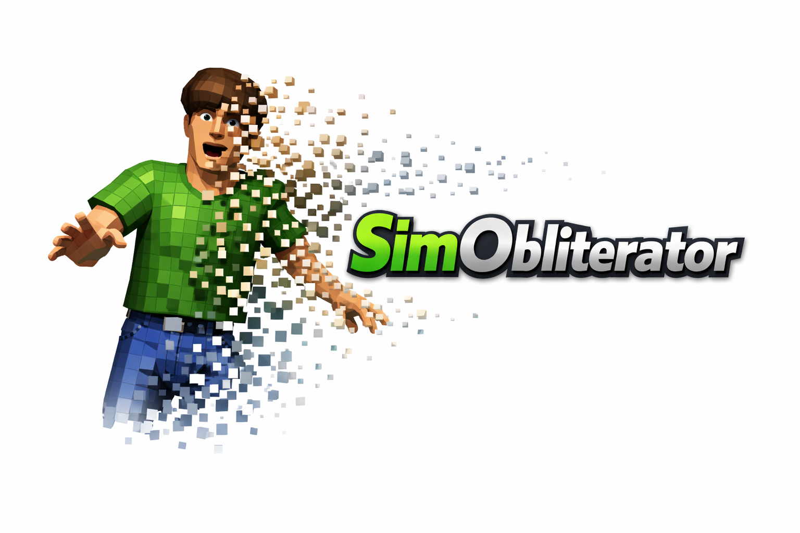

# SimObliterator Suite

<p align="center">
  
</p>

<p align="center">
  <strong>Professional IFF Editor & Analyzer for The Sims 1</strong><br>
  <em>Analyze • Edit • Extract • Research</em>
</p>

<p align="center">
  
  
  
  
</p>

---

## 🎯 Overview

SimObliterator Suite is a comprehensive desktop application for working with The Sims 1 game files. Whether you're a modder, researcher, or just curious about how the game works, this toolkit provides everything you need.

### Key Features

| Category              | Capabilities                                                  |
| --------------------- | ------------------------------------------------------------- |
| **File Formats**      | IFF, FAR1, FAR3, DBPF complete support                        |
| **Behavior Analysis** | BHAV disassembly, call graphs, execution tracing              |
| **Visual Assets**     | Sprite extraction, mesh export (glTF/GLB), animation decoding |
| **Save Editing**      | Sims, households, careers, relationships, motives             |
| **Safety**            | Backup system, preview mode, undo/redo, audit trail           |

---

## 🚀 Quick Start

### Option 1: Run from Source

```bash
# Install dependencies
pip install -r requirements.txt

# Launch the application
python launch.py
```

### Option 2: Standalone EXE

Download the latest release and run `SimObliterator.exe` - no installation required!

---

## 📖 What's Inside

### 🔍 Analysis Tools

- **IFF Inspector** - Browse chunk structure, view hex data
- **BHAV Disassembler** - Decode SimAntics bytecode with semantic names
- **Call Graph Builder** - Visualize behavior relationships
- **Forensic Analyzer** - Deep pattern analysis for research

### 🎨 Visual Tools

- **Sprite Viewer** - View SPR2 sprites with zoom and rotation
- **Animation Player** - Frame-by-frame animation analysis
- **Mesh Exporter** - Export 3D models to glTF/GLB
- **Sprite Extractor** - Batch export to PNG

### 💾 Save Editor

- **Sim Manager** - Skills, interests, personality
- **Motive Editor** - Hunger, energy, fun, social, etc.
- **Career Manager** - 24 career tracks, promotions
- **Household Editor** - Funds, members, lot assignment
- **Relationship Editor** - Daily/lifetime values

### 📦 File Operations

- **FAR Browser** - Browse and extract archives
- **IFF Merger** - Combine files with conflict resolution
- **Import/Export** - PNG, glTF, JSON support
- **Backup System** - Automatic backups before changes

---

## 🛡️ Safety First

SimObliterator uses a **three-mode safety system**:

| Mode           | Description                          |
| -------------- | ------------------------------------ |
| 🔵 **INSPECT** | Read-only, no changes possible       |
| 🟡 **PREVIEW** | See proposed changes before applying |
| 🟢 **MUTATE**  | Apply changes with full audit trail  |

Every write operation:

- Creates automatic backups
- Shows a preview of changes
- Can be undone/redone
- Is logged for audit

---

## 📊 Coverage

All 110 canonical actions are fully implemented:

```
FILE_CONTAINER   ████████████████████ 100%
SAVE_STATE       ████████████████████ 100%
BHAV             ████████████████████ 100%
VISUALIZATION    ████████████████████ 100%
EXPORT           ████████████████████ 100%
IMPORT           ████████████████████ 100%
ANALYSIS         ████████████████████ 100%
SEARCH           ████████████████████ 100%
SYSTEM           ████████████████████ 100%
UI               ████████████████████ 100%
```

---

## 📁 Project Structure

```
SimObliterator_Suite/
├── launch.py              # 🚀 START HERE - Application entry point
├── requirements.txt       # Python dependencies
├── README.md              # This file
├── LICENSE                # MIT License
├── VERSION                # Version info
├── CHANGELOG.md           # Release history
│
├── assets/                # Icons and splash screen
│   ├── icon.ico
│   ├── icon.png
│   └── splash.png
│
├── data/                  # Runtime databases
│   ├── opcodes_db.json    # 143 opcode definitions
│   ├── unknowns_db.json   # Unmapped opcode research
│   └── global_behaviors.json
│
├── Docs/                  # Documentation
│   ├── ACTION_MAP.md      # Feature inventory & architecture
│   ├── ACTION_SURFACE.md  # 110 canonical actions with safety tags
│   ├── TECHNICAL_REFERENCE.md  # IFF, BHAV, SLOT, TTAB formats
│   ├── PRIMITIVE_REFERENCE.md  # SimAntics opcode operands
│   └── UI_DEVELOPER_GUIDE.md   # Panel architecture & event system
│
├── Examples/              # Sample files for testing
│   ├── IFF_Files/
│   └── SaveGames/
│
├── src/                   # Source code
│   ├── main_app.py        # Main window (Dear PyGui)
│   ├── formats/           # File parsers (IFF, FAR, DBPF)
│   ├── Tools/core/        # Parsers, analyzers, editors
│   ├── Tools/gui/         # Panel implementations (incomplete)
│   ├── Tools/save_editor/ # Save file editing
│   └── utils/             # Binary utilities
│
└── dev/                   # Development tools
    ├── tests/             # Test suite
    │   ├── real_game_tests.py
    │   ├── test_suite.py
    │   ├── action_coverage.py
    │   └── test_paths.txt
    └── build/             # Build configuration
        ├── SimObliterator.spec
        ├── pyproject.toml
        └── BUILD.md
```

---

## 🔧 Development

### Prerequisites

- Python 3.9 or later
- pip package manager

### Setup

```bash
# Clone or extract
cd SimObliterator_Suite

# Create virtual environment (optional but recommended)
python -m venv .venv
.venv\Scripts\activate  # Windows

# Install dependencies
pip install -r requirements.txt
```

### Running Tests

The primary test suite validates parsers against real game files:

```bash
cd dev/tests

# Configure your game paths first
# Edit test_paths.txt with your installation paths

# Run all 73 tests across 17 categories
python real_game_tests.py

# Quick mode (fast subset)
python real_game_tests.py --quick

# Run specific category
python real_game_tests.py --category formats
python real_game_tests.py --category bhav
python real_game_tests.py --category saves
```

See [dev/README.md](dev/README.md) for full test configuration options.

### Building Standalone EXE

```bash
pip install pyinstaller
pyinstaller dev/build/SimObliterator.spec
```

Or simple build:

```bash
pyinstaller --onefile --windowed --icon=assets/icon.ico --name SimObliterator launch.py
```

---

## 📜 License

MIT License - see [LICENSE](LICENSE) for details.

This software is designed to work with The Sims 1 game files. The Sims is a trademark of Electronic Arts Inc. This project is not affiliated with, endorsed by, or connected to Electronic Arts Inc.

---

## 🙏 Credits

**Created by:** Dnf_Jeff  
**For:** The Sims 1 Modding & Research Community

Special thanks to:

- The FreeSO project for format documentation
- The Sims modding community for decades of research
- Everyone who helped test and provide feedback

---

<p align="center">
  <strong>Made with ❤️ for The Sims community</strong>
</p>
